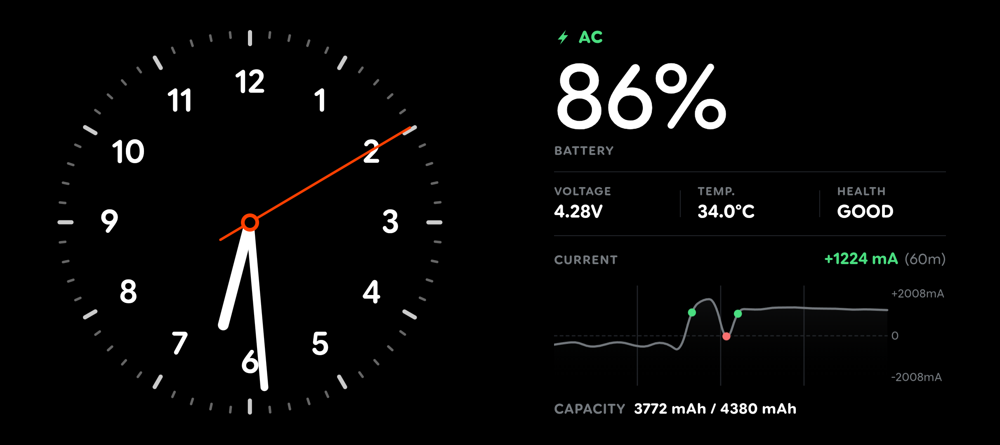
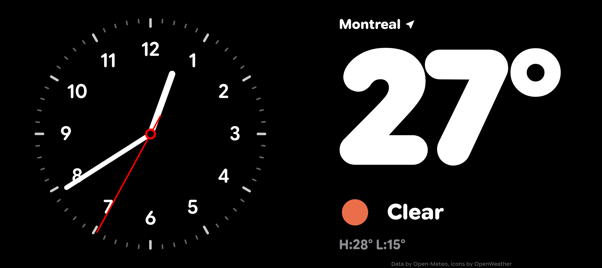
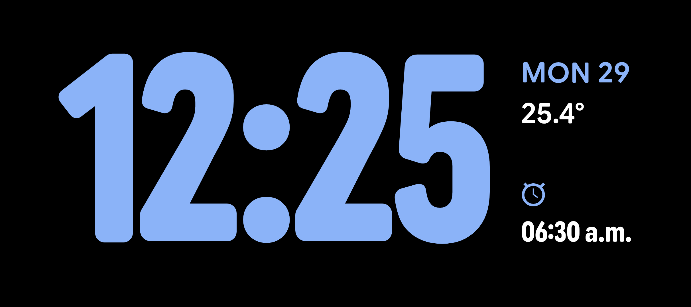
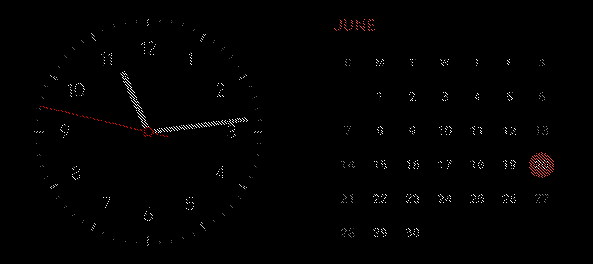

# Standby
> [!IMPORTANT]
> This app is still very much WIP!

**Standby** is a modular, open-source Android application similar to the iOS-style StandBy mode interface.

Unlike similar standby mode apps on the Play Store, Standby is 100% open-source, no ads, and does not lock core features (such as layouts or settings) behind paywalls.  

Most importantly, it is fully extensible instead of forcing you to choose from a fixed set of built-in templates, it allows you to build, customize, or modify your own widgets using simple HTML, CSS, and JavaScript.

---

## Currently Implemented Features

* **HTML/WebView Plugin Architecture**: Every widget is powered by standard web (HTML, CSS, JavaScript). There is no Android layout compiling or complex Kotlin development required to build or modify interfaces.
* **OLED Burn-In Protection**: Includes a built-in `PixelPerfectBurnInMask`. When the screen goes idle, the app places a grid overlay on top of the layout. Every 10 seconds, this grid shifts its pixel pattern to cycle active/inactive subpixel states across the display, avoiding burn-in.
* **Native Sensor Access (JavaScript Bridge)**: Through `window.AndroidSensors`, plugins can query local hardware metrics. This includes battery level, real-time power draw/current in mA, battery health ratings, proximity sensors, ambient light, system alarms, and more. 
* **Native Data Provider**: Through `window.AndroidProviders`, widgets can query data easily without complicated JS parsing or managing many API keys.
* **External API Integration**: Plugins can connect to the internet to perform standard network requests (e.g. via `fetch` or `XMLHttpRequest`) to fetch live data from external APIs.
* **Dynamic Layouts**: Renders a single full-screen widget or lets you pair two half-width widgets side-by-side.
* **Live Customization Engine**: Customize widgets on the fly. Changing a widget color or font in the app UI instantly updates CSS custom properties or global JavaScript variables in the active WebView without reloading the page.
* **Local Upload Server**: Upload plugins directly from your computer.
---

## Creating & Modifying Widgets

Adding your own custom widget or changing an existing one is straightforward since the app utilizes standard HTML pages as the foundation of every widgets.

### 1. The Structure
Each widget is stored or imported as a `.zip` archive containing:
1. `plugin_manifest.json` — Declares permissions, provider requests, widget size (`half` or `full`), and external network domains.
2. `plugin.html` — The actual UI structure, styles, and logic.
3. `customization.json` — Defines styling variables (e.g. colors, numbers) that users can edit in the app UI.
4. `assets/` — Subdirectory for fonts, audios, and images.

For details on manifest formats and the JavaScript bridges, see [DOCS.md](DOCS.md). 
### 2. Live Local Iteration
To build and debug widgets quickly without rebuilding the Android project, Standby includes a built-in local HTTP server. When enabled, it provides a simple web uploader portal over your local Wi-Fi. You can upload your widget ZIPs directly from your computer, input the PIN displayed on the app, and see your widgets load instantly on the device.

There are pre-configured example widgets under [app/src/main/assets/examples/](app/src/main/assets/examples/) to use as a starting template.

---

## Screenshots & Examples

Here is a visual overview of how the plugins render and interact with the Standby environment:

### Layouts & Formats
* **Side-by-Side (Half Width)**: Render two plugins simultaneously (e.g., an analog clock paired with a monthly calendar).
  
* **Full Screen**: Render a single widget spanning the entire screen.
  

### Example Widgets
* **Battery Stats Dashboard**: Queries local metrics via `window.AndroidSensors` to draw live charge current and voltage charts.
  
* **Clock & Weather Info**: Integration with the `window.AndroidProviders` local weather cache.
  
* **Custom Typography & Colors**: Clocks showcasing dynamic styling using CSS variables.
  
  

### Controls & Screen Safety
* **In-App Customizations**: Edit colors, thresholds, or switches declared in `customization.json` using native Android color pickers and sliders.
  
* **Active OLED Burn-In Mask**: The pixel-shifting checkerboard overlay pattern that cycles subpixels to avoid screen retention.
  

---

## Building the App

To compile the Android app from source:

1. Configure your local Java environment. For instance, in PowerShell:
   ```powershell
   $env:JAVA_HOME = "C:\Users\haxin\AppData\Local\Programs\Android Studio\jbr"
   ```
2. Run the Gradle build task:
   ```bash
   ./gradlew assembleDebug
   ```
