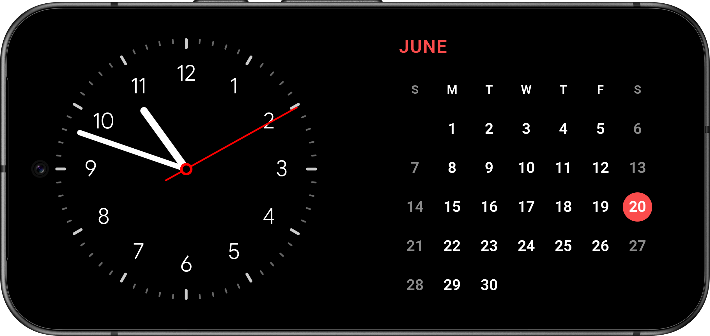
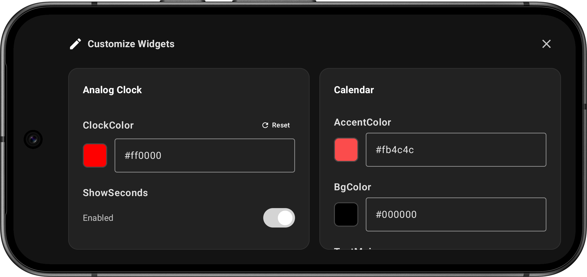
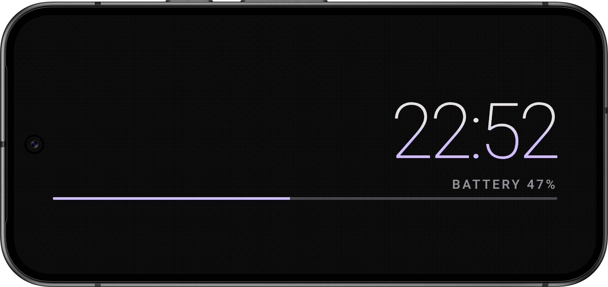

# Standby
> [!IMPORTANT]
> This app is still WIP!

A modular, customizable and open source app similar to the StandBy mode on iOS devices for Android.  

Plugins can be created and imported by users. See example in `app/src/assets/examples/sample_plugin` and `SPEC.md` for specific plugin formats.  

Plugins also support configuration options for CSS or JS.  

Supports full screen plugins as well as two plugins side by side.  

