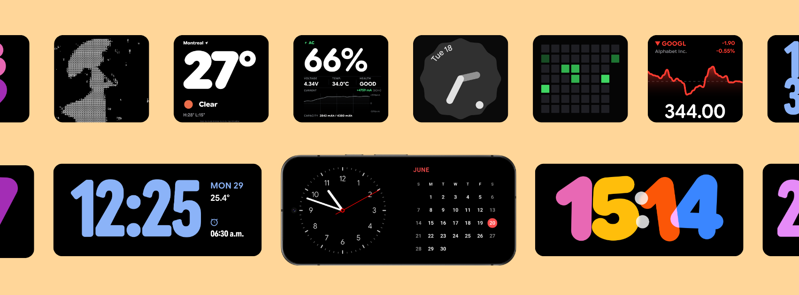

# Standby
> [!IMPORTANT]
> This app is still very much WIP!

**Plugins can be found under [plugins/build/](plugins/build/)**

**Standby** is a modular, open-source Android app similar to the iOS StandBy mode.

Unlike similar standby mode apps on the Play Store, Standby is 100% open-source, has no ads, and does not lock core features (like layouts or settings) behind paywalls.  

Most importantly, it is fully extensible via HTML/CSS/JS instead of forcing you to choose from a fixed set of built-in templates. This allows you to build, customize, or modify your own widgets.

--- 

## Installation

1. **Download the APK**: Download the latest `.apk` from the [GitHub Releases](https://github.com/Haxintosh/standby/releases)  
2. **Install**: Tap the downloaded APK file and select `Install`.
3. **Allow Installation**: If needed, allow your browser or file manager to install apps from unknown sources (*Settings > Apps > Special app access > Install unknown apps*).
4. **Import Plugins**: Launch Standby, tap on the settings menu to enable the local upload server or load plugins from [`plugins/build/`](plugins/build/).

---

## Currently Implemented Features

* **HTML/WebView Plugin Architecture**: Every widget is powered by standard web (HTML, CSS, JavaScript). 
* **Third-Party Android App Widgets**: Standby can host native Android App Widgets from other apps installed on your device (ie Spotify, Gmail, clocks, calendars, and more). 
* **Intelligent Night Time Mode**: Configure scheduled nighttime hours. The app automatically locks to a dimmed low-brightness state and increases OLED burn-in protection during the configured sleep hours.
* **OLED Burn-In Protection**: When the screen goes idle, the app places a grid overlay on top of the layout. This grid shifts its pixel pattern to cycle active/inactive subpixel to avoid burn-in.
* **Native Sensor Access (JavaScript Bridge)**: Through `window.AndroidSensors`, plugins can query local hardware metrics. 
* **Native Data Provider**: Through `window.AndroidProviders`, widgets can query data easily without complicated JS parsing or managing many API keys.
* **External API Integration**: Plugins can connect to the internet to perform standard network requests to fetch live data from external APIs.
* **Dynamic Layouts**: Renders a single full-screen widget or lets you pair two half-width widgets side-by-side.
* **Live Customization Engine**: Customize widgets on the fly. Change a widget color or font in the app UI.
* **Local Upload Server**: Upload plugins directly from your computer.
---

## Creating & Modifying Widgets

Adding your own custom widget or changing an existing one is simple as the app relies on standard HTML pages.

### 1. The Structure
Each widget is stored or imported as a `.zip` archive containing:
```text
plugin.zip/
├── plugin_manifest.json     # Metadata, permissions, and sizing
├── plugin.html              # Main HTML entry point
├── customization.json       # Configures user-customizable options
└── assets/                  # Images, fonts, styles, or scripts
    ├── sunset.png
    ├── style.css
    └── font.ttf
```
For details on manifest formats and the JavaScript bridges, see [DOCS.md](DOCS.md). 
### 2. Plugin Upload Server
To build and debug widgets quickly, Standby includes a built-in local HTTP server. When enabled, it provides a simple web uploader over your local Wi-Fi. You can upload your widget ZIPs directly from your computer, input the PIN displayed on the app, and see your widgets load instantly on the device.

There are pre-configured example widgets under [app/src/main/assets/examples/](app/src/main/assets/examples/) to use as a starting template.

---

## Screenshots & Examples

Here is a visual overview of how the plugins render and interact with the Standby environment:

### Layouts & Formats
* **Side-by-Side (Half Width)**: Render two plugins simultaneously (e.g., an analog clock paired with a monthly calendar).
  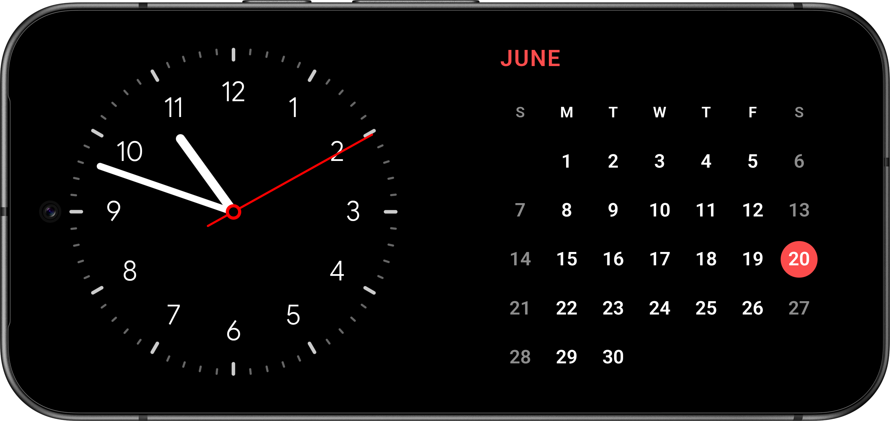
* **Full Screen**: Render a single widget spanning the entire screen.
  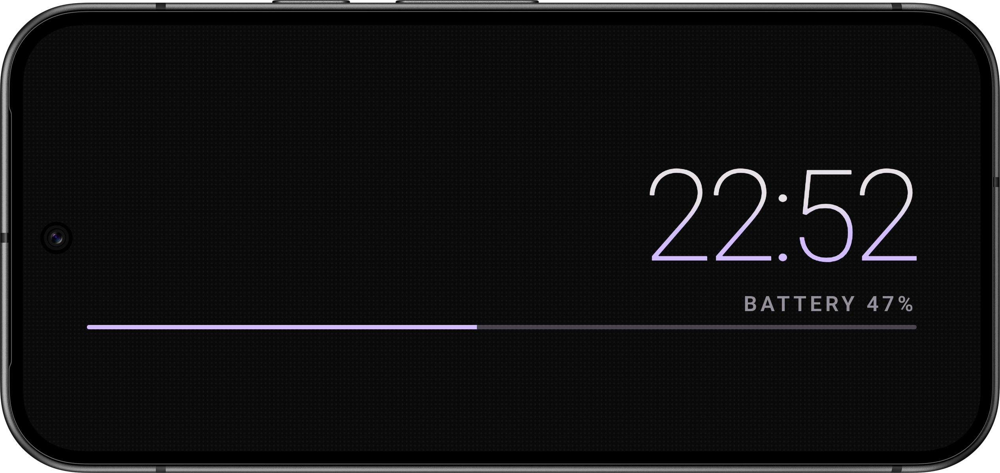

### Example Widgets
* **Battery Stats**: Queries local metrics via `window.AndroidSensors` to draw live charge current and voltage charts.
  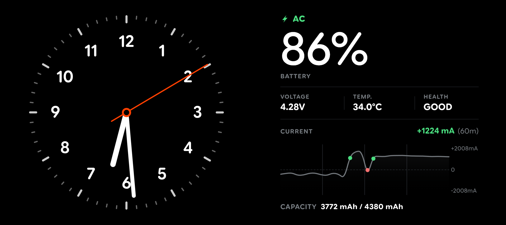
* **Weather Info**: Integration with the `window.AndroidProviders` local weather cache.
  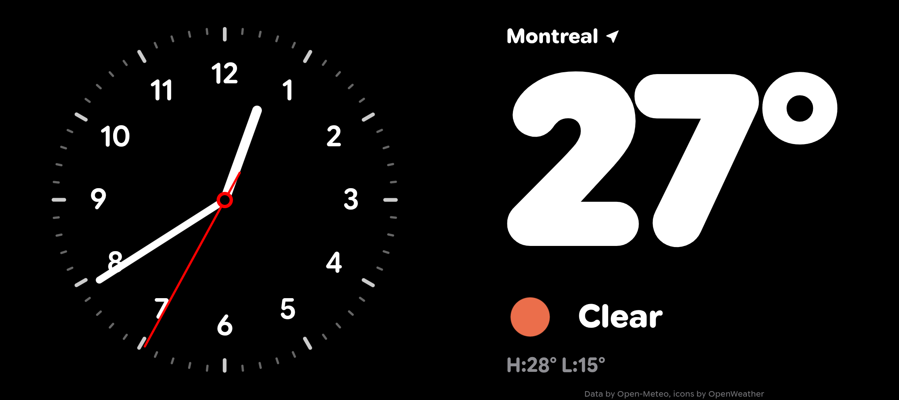
* **Bad Apple**: Bad Apple. 
  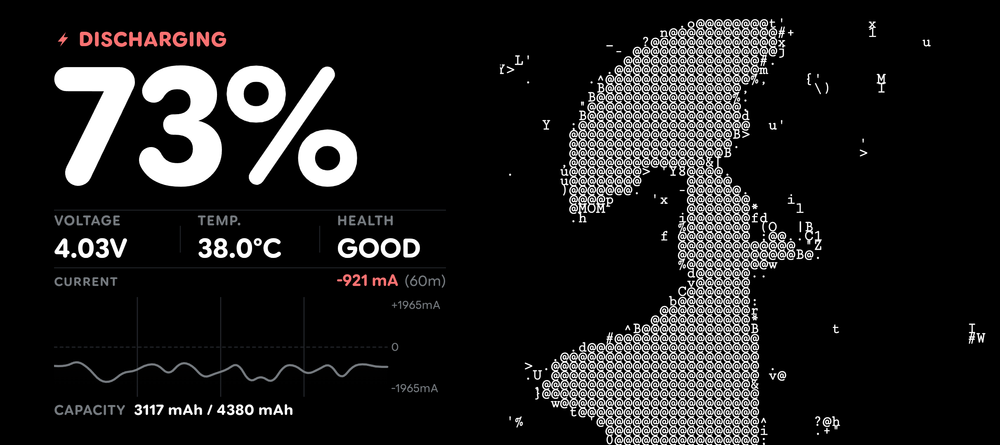
* **3rd party widgets**:
  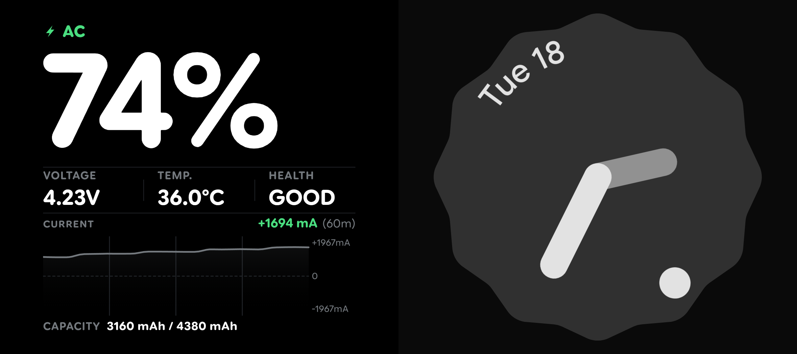
  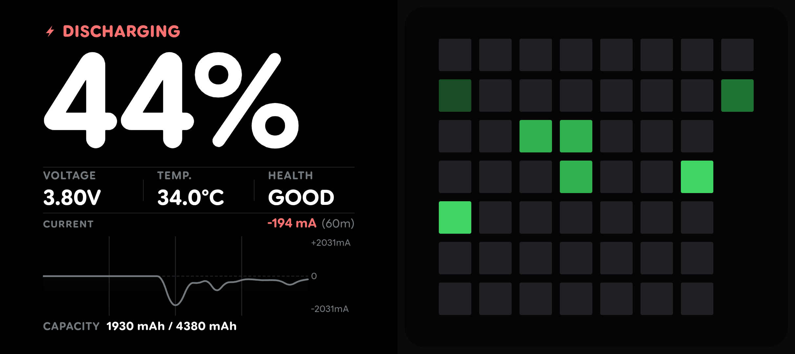
* **Other clocks**:
  
  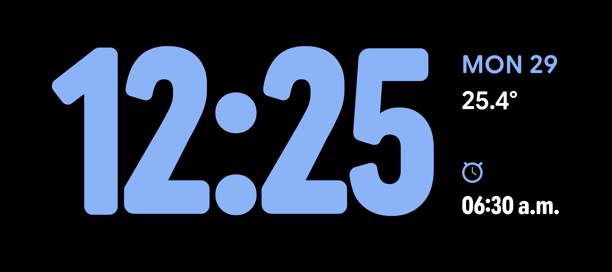
  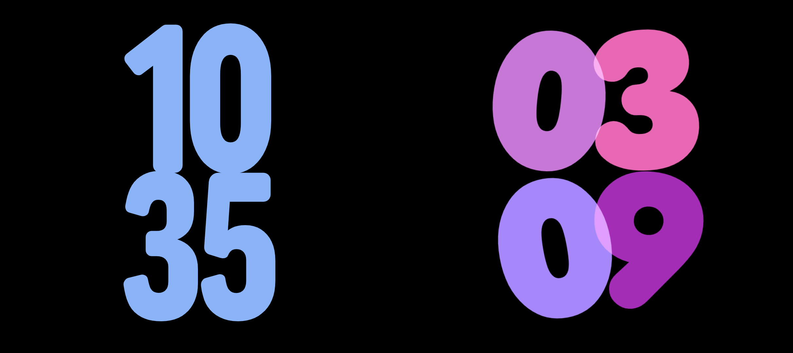

### Controls, Settings & Screen Safety
* **In-App Customizations**: Edit colors, thresholds, or switches declared in `customization.json`.
  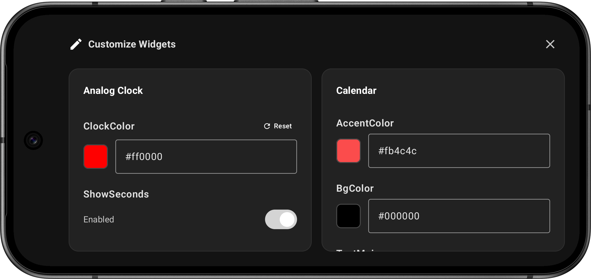
* **Night Time Mode**: Scheduled night hours, automated dimming, etc.
  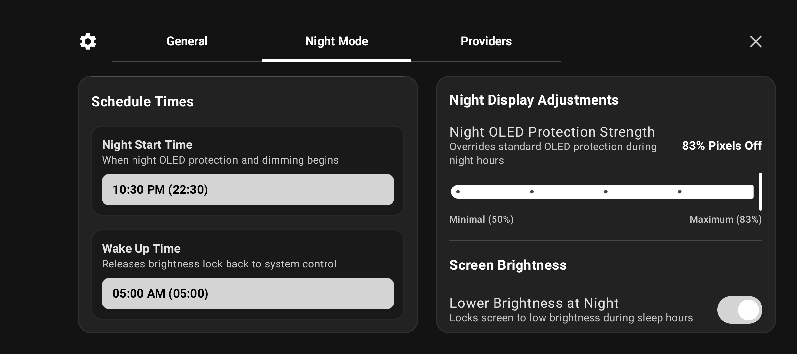
* **Active OLED Burn-In Mask**: The overlay pattern that cycles pixels to avoid screen retention.
  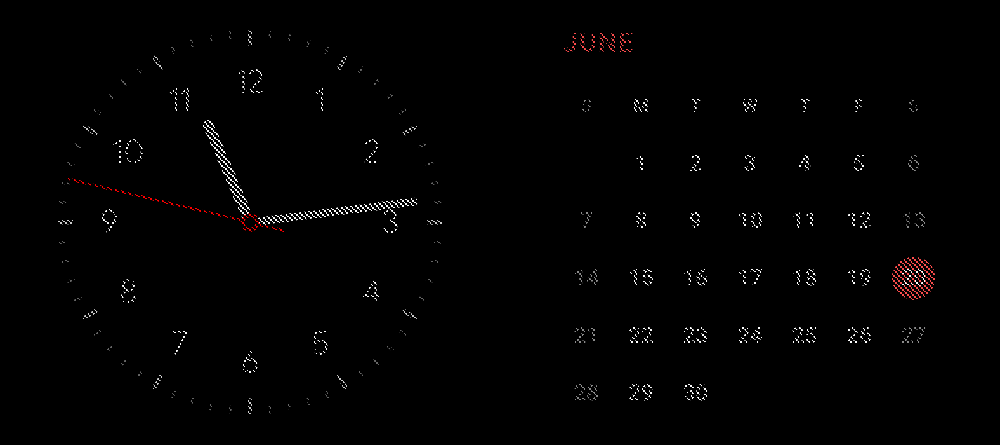

---

## Permissions
* **`INTERNET`**: Allow web plugins to fetch online data and to run the local plugin upload server.
* **`VIBRATE`**: Powers tactile haptic feedback.
* **`QUERY_ALL_PACKAGES` / AppWidget Queries**: Required by Android's `AppWidgetHost` to discover, configure, and embed native app widgets.

---

## Building
1. Run the Gradle build task:
   ```bash
   ./gradlew assembleDebug
   ```
